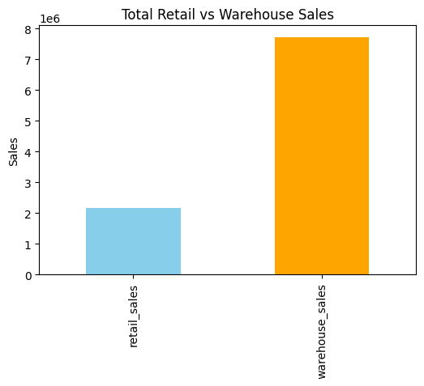
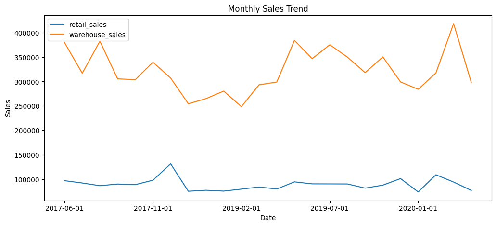
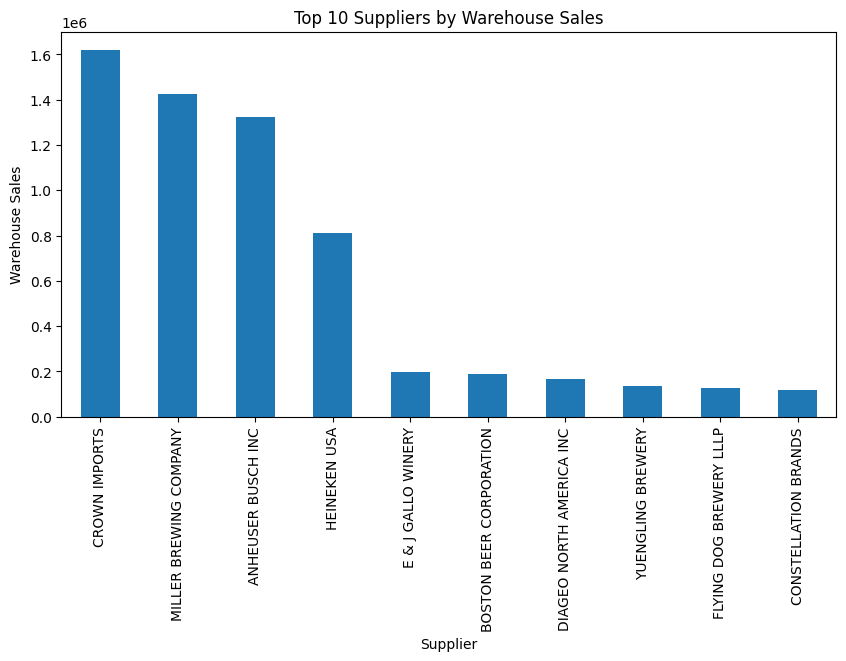
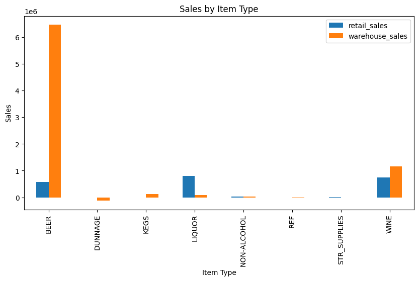

# 📊 Warehouse & Retail Sales Data Analysis

## 📌 Project Overview

This project analyzes warehouse and retail sales data to identify trends in product performance, supplier contribution, and sales distribution across retail and warehouse channels.

The goal is to simulate a real-world business scenario where data is used to drive inventory and sales decisions.

---

## 🎯 Objectives

* Clean and preprocess raw sales data
* Analyze retail vs warehouse sales trends
* Identify top-performing suppliers and products
* Perform time-based analysis (monthly/yearly trends)
* Generate actionable business insights

---

## 🛠️ Tech Stack

* **Python** (Pandas, Matplotlib)
* **SQL** (SQLite/PostgreSQL)
* **Jupyter Notebook**
* **Power BI / Tableau** (for dashboard)

---

## 📂 Dataset Description

The dataset contains sales data with the following key columns:

* YEAR → Year of sales
* MONTH → Month of sales
* SUPPLIER → Supplier name
* ITEM CODE → Unique product ID
* ITEM DESCRIPTION → Product details
* ITEM TYPE → Product category
* RETAIL SALES → Sales through retail channel
* RETAIL TRANSFERS → Transfers between retail locations
* WAREHOUSE SALES → Sales from warehouse

---

## 📂 Project Structure

ecommerce-sales-data-analysis
│
├── data/ → raw and cleaned datasets
├── notebooks/ → analysis notebooks
├── scripts/ → data cleaning scripts
├── sql/ → SQL queries
├── dashboard/ → dashboard files
└── README.md

---

## 🔄 Workflow

Raw Data
↓
Data Cleaning (Python)
↓
Exploratory Data Analysis
↓
SQL Queries
↓
Dashboard Visualization

---

## 📊 Key Analysis Performed

### 1. Sales Trends

* Monthly sales trends across years
* Retail vs Warehouse comparison

### 2. Supplier Performance

* Top suppliers by total sales
* Supplier contribution to revenue

### 3. Product Analysis

* Best-selling items
* Sales by item type/category

### 4. Channel Analysis

* Retail Sales vs Warehouse Sales
* Transfer patterns

---

## 💡 Key Insights

### Retail vs Warehouse Sales

- Warehouse sales contribute more than retail overall.

### Monthly Sales Trend

- Sales peak in specific months, indicating seasonality.

### Top Suppliers

- Supplier X is the top contributor to warehouse revenue.

### Sales by Item Type

- Item type Y consistently performs best across channels.
---

## 🧠 What I Learned

* Handling real-world structured sales data
* Data cleaning and preprocessing using Pandas
* Writing SQL queries for business insights
* Performing time-series analysis
* Building visual dashboards for decision-making

---

## 🚀 How to Run This Project

1. Clone the repository

2. Install dependencies
   pip install -r requirements.txt

3. Run data cleaning script
   python scripts/data_cleaning.py

4. Open Jupyter notebook
   jupyter notebook

